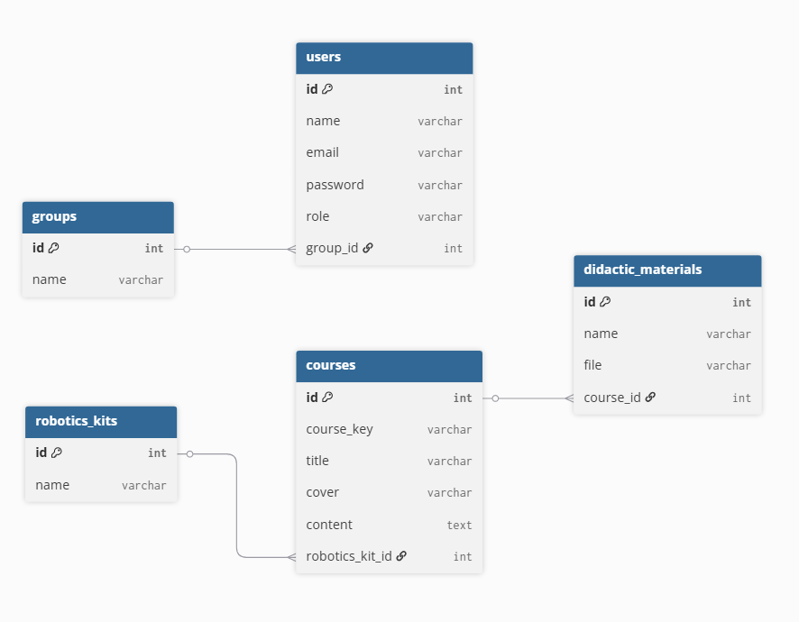

# Activity 7 and Homework 6 - Robotics School Platform

## Project Name

Robotics School Platform (Activity 7)

## Project Description

This project consists of the development of a small platform for a robotics school. The system allows users to register on the platform with different roles: student, teacher, or administrative staff.

Students belong to groups such as beginner, intermediate, and advanced. Groups can have several courses assigned to them, and each course contains information such as title, cover, and content. Additionally, each course is associated with a robotics kit and can include didactic materials that help teachers conduct their classes.

The project was developed using Laravel and Eloquent ORM to model and manage the relational database.

The database was populated using:

* Seeders for users and robotics kits
* A factory to generate 100 fake course records using FakerPHP

## ER Diagram

The ER diagram shows the main entities of the system and their relationships, including users, groups, courses, robotics kits, and didactic materials.

