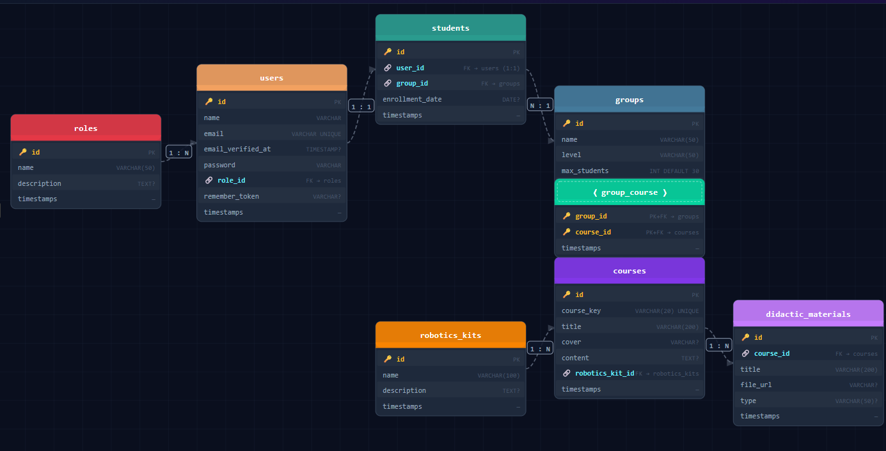

## Robotics School Platform

A web platform built with Laravel for managing a robotics school. It handles users with different roles (admin, teacher, student), organizes them into groups, and lets teachers assign courses that are tied to specific robotics kits. Each course can also have didactic materials like PDFs or videos attached to it.

- [This project was built using Laravel 12, Eloquent ORM, MySQL, and Git/GitHub for version control.]

## ER Diagram

